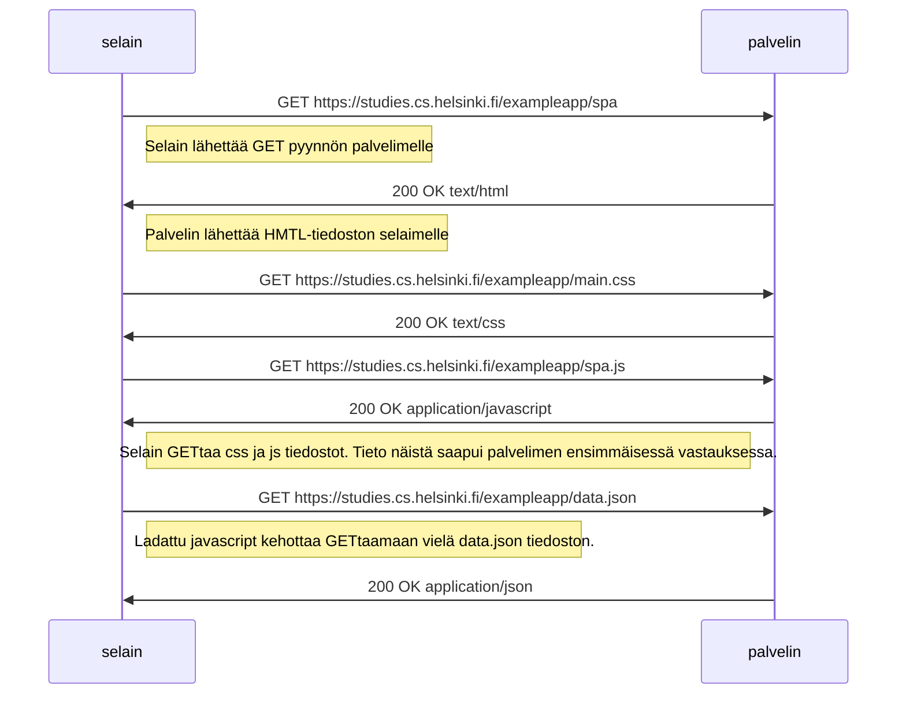

```mermaid
sequenceDiagram
    participant selain
    participant palvelin

    selain->>palvelin: GET https://studies.cs.helsinki.fi/exampleapp/spa
    Note right of selain: Selain lähettää GET pyynnön palvelimelle
    palvelin->>selain: 200 OK text/html
    

    Note right of selain: Palvelin lähettää HMTL-tiedoston selaimelle

    selain->>palvelin: GET https://studies.cs.helsinki.fi/exampleapp/main.css
    palvelin->>selain: 200 OK text/css
    selain->>palvelin: GET https://studies.cs.helsinki.fi/exampleapp/spa.js
    palvelin->>selain: 200 OK application/javascript

    Note right of selain: Selain GETtaa css ja js tiedostot. Tieto näistä saapui palvelimen ensimmäisessä vastauksessa.


    selain->>palvelin: GET https://studies.cs.helsinki.fi/exampleapp/data.json
    Note right of selain: Ladattu javascript kehottaa GETtaamaan vielä data.json tiedoston.
    palvelin->>selain: 200 OK application/json
```

    

